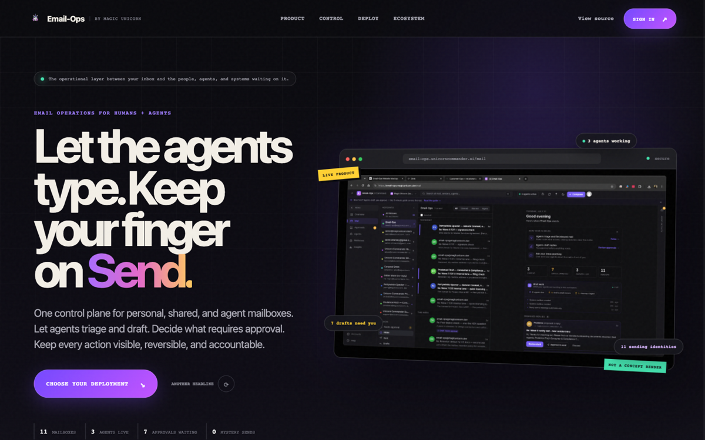
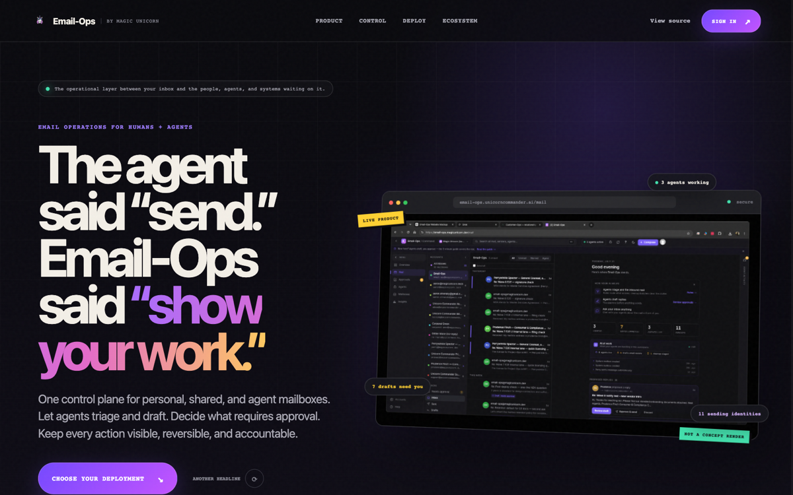

# Email-Ops

The **mailbox / thread surface + agent-inbox** of the Unicorn Commander suite.

**v0.6.0 — LIVE (Wave 1 shipped):** Real triage moves mail in James, JMAP send lane saves copies, security headers, and Forgejo CI.

Email-Ops is the app that **fronts the Apache James mail server** (JMAP) for mailbox state + threads, and owns the **agent inbox** — the human-in-the-loop approval queue for agent-drafted mail. It is the system-of-record for every mailbox, thread, and outbound message it initiated. Transactional outbound routes via **Postmark** (the high-rep deliverability lane); the mailbox read/move path is **Apache James 3.9** (the live MX — James replaced Stalwart in the P-00106 migration; the internal `stalwart/` module name is legacy). (`SUITE-ARCHITECTURE-MAP.md` §2/§3.)

**Golden rule:** *federate the engine, don't reinvent a mail server.* A cockpit (e.g. Customer-Ops) federates Email-Ops over MCP **by `workspace_id`** — it never runs a mail server, never stores a message body, never copies a thread.


## Screenshots

<p align="center">
  
</p>

<p align="center"><em>Email-Ops command center — mailboxes, agent inbox, and chain-of-command email</em></p>

<p align="center">
  
</p>

<p align="center"><em>Live product surface</em></p>

Live: **[email-ops.unicorncommander.ai](https://email-ops.unicorncommander.ai)**

---
## Agent Email Command Center

The `/mail` surface is a full webmail client run **with a human in the loop over an agent fleet**:

- **Webmail** — a 4-pane command center over every workspace mailbox (sovereign James + connected Gmail / Microsoft 365): search, HTML mail (rendered in a sandboxed, theme-correct iframe), attachments, reply/reply-all/forward, bulk actions, keyboard shortcuts, message **pop-out** (overlay + eject-to-window), and **All inboxes** (a bounded, timed fan-out that merges every mailbox newest-first). A **command-center chrome** wraps every page: an expandable section rail, and a folders pane that collapses to a slim avatar rail rather than vanishing.
- **Chat that acts** — a streaming assistant in the rail that not only summarizes/triages but **stages work into the approval queue**: threaded **draft replies** and **cleanup batches** (Archive / Trash). Cleanup against your own James inbox runs a real JMAP move — only after you click **Approve & run**.
- **Agent activity rail** — a live timeline with real, server-computed metrics (`GET /workspaces/:id/agent-metrics?window=7d`): **Triaged** (threads an agent filed), **Sent** (agent autonomous + approved sends), **Awaiting** (pending approvals). Honest counts — not a client-side proxy.
- **Autonomy dial + kill switch** — per-agent **L0** draft-only / **L1** approve-to-send / **L2** autonomous-with-audit, plus a global **Pause all agents** switch.
- **Agent Inbox** — the approval queue: agents stage drafts (and cleanup batches); a human **Approve & sends** or **Rejects**, every decision attributed.
- **In-app Help** — a discoverable guide behind the **`?`** button in the mail top bar (and the `?` key) covers all of the above plus the keyboard shortcuts.
- **MCP** — connect Claude Code / suite agents to drive all of it with an `eo_pat_` token. See **[docs/MCP.md](docs/MCP.md)**.

## What it owns vs federates

| | |
|---|---|
| **Owns** | mailboxes/threads/messages (over Apache James), the agent inbox (approval queue), the outbound message SoR (idempotent on the compose tuple) |
| **Federates the engine** | Apache James 3.9 (JMAP mailboxes) for reads/moves; Postmark for the transactional outbound lane |
| **Federated BY** | Customer-Ops (the relationship cockpit) + agents, via the EmailOpsPort MCP contract |

## The EmailOpsPort contract (what the MCP server implements)

The three tools match Customer-Ops' `backend/src/email-ops/` contract verbatim (so the cockpit federates us for real). All emit the payload as MCP `structuredContent` (the cockpit's client reads that first):

- `list_threads_with_contact(workspace_id, contact_id)` → `{ threads: [...] }` — viewer-level (no dual SKU)
- `list_thread_messages(workspace_id, thread_id)` → `{ messages: [...] }` — previews only, viewer-level
- `compose_email(workspace_id, contact_id, to_address, subject, body, mode[send|draft], in_reply_to_thread_id?, external_source, external_ref)` → the message view.
  - **Idempotent** on `(workspace_id, external_source, external_ref)` — a repeat returns the existing message, queues no second send.
  - `mode=send` queues delivery (Stalwart/Postmark); `mode=draft` stages the **agent inbox** (a human approves before it leaves).
  - Requires **both** `customer-ops` AND `email-ops` entitlements (the `UC_ENTITLEMENT_MODE=open` bootstrap bypasses with a WARN).

Plus foundation tools (`health`, `list_my_workspaces`) and the agent-inbox approval tools (`list_agent_inbox`, `approve_agent_inbox_item` (sends), `reject_agent_inbox_item`).

## Phase 1 (this layer) — the tenancy foundation

Copied verbatim-in-spirit from the proven Customer-Ops / Project-Ops tenancy pattern (`SUITE-IDENTITY.md`):

- **Workspace + Membership** tenancy boundary (§2), `User` is a global SSO identity; the Membership row gates workspace access (zero access until a membership exists, §D5).
- **Prisma Migrate** (versioned SQL is the source of truth) — single linear head: `…_suite_tenancy_foundation` → `…_suite_tenancy_rls_roles`.
- **RLS**: `ENABLE` + `FORCE` + a `workspace_isolation` policy on every scoped table (`mailbox_accounts`, `email_messages`, `agent_inbox_items`), the `current_workspace_id()` GUC (`app.current_workspace`), and `PrismaService.withWorkspace()` as the GUC chokepoint.
- **4-role split**: `email_ops_owner` (BYPASSRLS, DDL), `email_ops_app` (NOBYPASSRLS runtime — the fence goes live when `DATABASE_URL` flips to it), `email_ops_audit`, `email_ops_ro`.
- **Keycloak auth** (uchub realm, RS256), `aud=email-ops`, membership-gated, behind `EMAIL_OPS_TENANCY_ENABLED` (default **off** — current behavior).
- **StalwartPort + client** (mockable, degrade-clean): unset `STALWART_*` ⇒ reads return empty, sends record FAILED, agent-inbox + SoR still work — no hard mail-server dependency.
- **MCP server** exposing the EmailOpsPort contract + the agent-inbox tools.

## Layout

```
backend/                 NestJS 10 + Prisma 5 + Postgres
  prisma/
    schema.prisma        Workspace+Membership+User + MailboxAccount/EmailMessage/AgentInboxItem
    migrations/          2 migrations (foundation + RLS roles); single head
    rls-acceptance.sql   the RLS proof (run AS email_ops_app)
  src/
    prisma/              PrismaService.withWorkspace() — the GUC chokepoint
    common/workspace/    membership gate, workspace resolver, feature flag, guard
    auth/                Keycloak + Brigade JWT (aud=email-ops), access list
    stalwart/            StalwartPort + degrade-clean client (JMAP read; Postmark/Stalwart send)
    email/               EmailService (SoR + EmailOpsPort contract + agent-inbox), entitlement gate
    mcp/                 the EmailOpsPort contract MCP server + agent-inbox tools
    health/
frontend/                Next.js 15 shell (SSO login + agent-inbox surface)
infrastructure/database/init/  role-split bootstrap SQL
```

## Verify (Phase 1)

```bash
# backend build + typecheck + tests (Stalwart mocked; the 3 contract tools, idempotency,
# draft-vs-send, the agent-inbox approve flow, the dual-SKU gate, degrade-clean)
cd backend && npm install && npx prisma migrate deploy && npx nest build && npx tsc --noEmit && npx jest

# RLS proof AS the NOBYPASSRLS runtime role (no-GUC=0, FORCE on all scoped tables,
# cross-workspace read/write blocked)
PGPASSWORD=verify_app psql "postgresql://email_ops_app@localhost:55444/emailops" \
  -v ON_ERROR_STOP=0 -f prisma/rls-acceptance.sql

# frontend
cd frontend && npm install && npm run build
```

## Phase 2 (next)

The mailbox/thread cockpit UI + the agent-inbox approval UI (the routes/shell ship in Phase 1; wire them to the existing `list_agent_inbox`/`approve`/`reject` surface), a live Stalwart node + the real JMAP mailbox-account credential resolution, inbound mail sync (received threads), a REST surface alongside the MCP tools, and the Brigade RFC-8693 token mint replacing the dev service-token seam.

## License

Email-Ops is licensed under the **GNU Affero General Public License v3.0** (AGPL-3.0-or-later) — see [LICENSE](LICENSE).

A **commercial license** is available for organizations that cannot meet the AGPL's network-copyleft obligations (for example, offering Email-Ops as a hosted service without releasing their modifications). Contact **email-ops@unicorncommander.ai**.

© 2026 Magic Unicorn Unconventional Technology & Stuff Inc.
